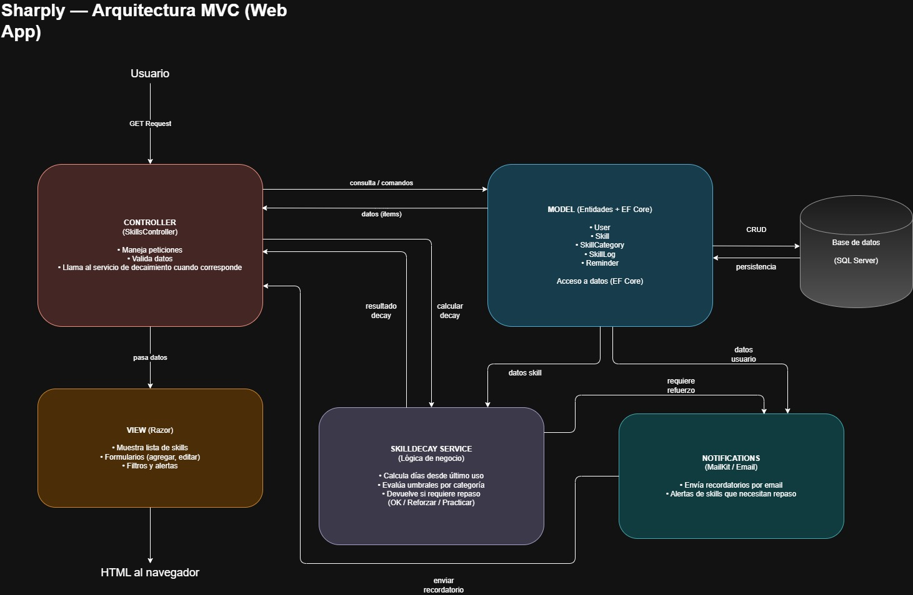

# ADR-01: [Título corto de la decisión]

| Campo  | Valor |
|--------|-------|
| Autor  | [AriffMedina] |
| Fecha  | 15/05/2026 |
| Estado | Propuesto |

---

## Contexto

Sharply será una aplicación web dirigida a personas que manejan diferentes tecnologías. Será diseñada para resolver el problema del deterioro de habilidades, las personas aprenden muchas herramientas pero suelen olvidar fácilmente aquellas que no practican constantemente, no por no querer hacerlo, sino por olvidar reforzarlas. 

En cuanto a las condiciones o restricciones que influyeron en esta decisión es fundamental recalcar las tres más importantes. Se construirá bajo los tiempos limitados de las entregas puestas por el profesor Jorge Javier Pedrozo Romero (tentativamente cada viernes), la arquitectura estará mayormente alineada a los temas vistos en las clases de Arquitectura de Software para tener una mayor facilidad de resolver los problemas que vayan surgiendo con el tiempo, por último es un proyecto independiente, por lo que toda la carga recaerá en mi persona así que se priorizará la simplicidad y se evitarán aspectos muy ambiciosos o que impliquen mucha sobre-ingeniería.

---

## Decisión

Para este proyecto se utilizará ASP.NET 10.0 con Core MVC en lenguaje C# como framework principal para la capa visual y lógica de la aplicación, siguiendo el patrón arquitectónico MVC y usando MailKit como librería principal para el sistema de notificaciones.

### ¿Por qué?

Sharply está pensada para ser una herramienta CRUD y tener flujos lineales, usando el patrón MVC puedo almacenar la lógica de deterioro de habilidades en los controladores, así me será más sencillo ajustar el/los algoritmo/s en un solo lugar. Además ASP.NET MVC integra Entity Framework Core de forma nativa, por lo que mis entidades pensadas: "skill", "log" y "usuario" podrán mapearse directamente a tablas SQL sin configuración adicional pudiendo así evitar retrasos en infraestructura. Sin embargo en un futuro me gustaría migrarla a una aplicación movil como proyecto personal, por lo que puede hacerme más sencillo el proceso al hacerla con MAUI, puesto que puedo exponer un API Controller dentro del mismo proyecto sin cambiar de arquitectura.

### Alternativas consideradas

| Alternativa | Por qué la descarté |
|-------------|---------------------|
| MVVM        | A pesar de que pudo haber sido la opción que pudo darme mejores resultados, con las restricciones antes mencionadas no sería lo más eficiente, para las finalidades del proyecto no tengo pensado que la plataforma implemente reactividad compleja ni estados en tiempo real  |
| MVP         | Pudo ser buena para separar de mejor manera las responsabilidades y me pudo facilitar el testeo, pero considero que me exigiría más clases e interfaces, por lo que generaría mucho código repetitivo que ralentizaría el desarrollo del proyecto sin un beneficio lo suficientemente significativo |
| Arquitectura Hexagonal         | Es la opción más robusta arquitectónicamente hablando, pero sería un exceso de complejidad para una aplicación simple, puesto que agrega muchas capas (puertos, adaptadores) que no son necesarias para la plataforma |

---

## Consecuencias

**✅ Lo que gano:**

*Técnicamente:* Con la ventaja de que Entity Framework Core ya está integrado, el desarrollo se agilizará para las operaciones CRUD que tengo pensadas para las skills

*En el desarrollo:* Al estar el proyecto mayormente enfocado en las tecnologías que vemos en clase, reduzco la curva de aprendizaje y el tiempo de investigación, permitiéndome enfocar la energía en cumplir con mis entregas sin pelear con otros lenguajes u otras tecnologías.

**⚠️ Lo que sacrifico o asumo:**

Menciona al menos:
*Limitante técnico:* Utilizar MVC me limita bastante a poder hacer una plataforma con la interactividad fluida de una Single Page Application. Al renderizar las vistas desde el servidor, las interacciones requerirán recargas de página

*Riesgo técnico:* A pesar de que mencioné que poner la lógica en la capa de controladores por facilidad inicial, para poder integrar MAUI para la aplicación movil tendría que extraer esa lógica y depositarla en una capa de servicios independiente, lo que podría generar una deuda técnica ya que tendría que desacoplarlo después si el proyecto crece. 

## Diagrama

