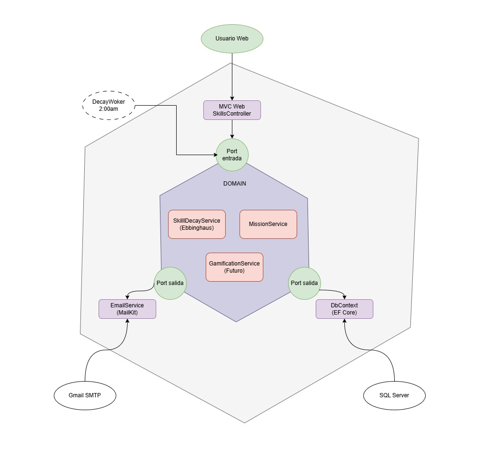

# ADR-03: Adopción de estilo arquitectónico hexagonal

| Campo  | Valor |
|--------|-------|
| Autor  | AriffMedina |
| Fecha  | 12/06/2026 |
| Estado | Aceptado |

---

## Contexto

Después de que establecí el uso del patrón MVC en mi primer ADR el alcanze de sharply ha evolucionado de forma significativa respecto a la visión original que se tenía.

En ADR-01 se asumió que Sharply sería una herramienta lineales, lo cual me permitía justificar el no usar la Arquitectura Hexagonal por considerarla un overkill. Sin embargo, hay tres factores que cambiaron esa concepción:

**Deuda técnica:** En el primer registro se reconoció como riesgo que la lógica de deterioro de habilidades quedaría unida a los controladores web, y que extraerla después sería tedioso técnicamente hablando.

**Proyección hacia app móvil:** Querer pasar Sharply a movil con MAUI como proyecto personal sigue en pie. Eso puedo lograrlo separando la lógica de negocio de esa interfaz y se evita la duplicación de código.

**Crecimiento del dominio:** Si quiero agregar un sistema de gamificación eso significa agregar servicios con lógica propia como `GamificationService`, además de los que ya estaban previstos como `SkillDecayService` y `MissionService`. Esta lógica debería estar protegida por diseño.

---

## Decisión

Adoptar el estilo arquitectónico de **Arquitectura Hexagonal (Ports & Adapters)** para mi plataforma Sharply

### ¿Por qué?

El núcleo de negocio de Sharply (el algoritmo de Ebbinghaus, la evaluación de maestría y la lógica de gamificación) no debería saber nada de la tecnología que lo rodea. Con este estilo arquitectónico, este núcleo se define en términos de interfaces (Ports), y cualquier tecnología concreta (como SQL Server, MailKit, un controlador web, una API para MAUI) se conecta como un Adapter intercambiable.

De esta forma puedo atacar los puntos antes mencionados. La deuda técnica del ADR-01 se cancela desde el inicio puesto que la lógica ya no vive en los controladores, sino en el núcleo, y los controladores son simplemente Adapters de entrada.Además agregar la app móvil en MAUI se pasa a crear un nuevo Adapter de entrada (una API Controller), sin tener que tocar la lógica de servicios. Finalmente, el crecimiento de esta lógica no afecta el sistema: añadir `GamificationService` sería agregar un nuevo servicio al núcleo, y sus dependencias de salida (persistencia de puntos, insignias) son otros nuevos Adapters.

Además, esta arquitectura es coherente con la decisión de desplegar la plataforma en una sola instancia EC2 con RDS puesto que el estilo hexagonal nos permite mantener el alojamiento web sencillo, gestionando conexiones a través de Adapters de salida sin impactar el rendimiento del servidor.

Se tiene una intención de en un futuro incorporar **eventos en memoria** mediante MediatR para desacoplar las reacciones internas al evento `MisionCompletada`.

**Sobre la proyección con MediatR:** Cuando el evento `MisionCompletada` ocurra, múltiples partes del sistema deberán reaccionar de forma independiente: el `SkillDecayService` reinicia la curva de Ebbinghaus, el `GamificationService` suma XP y evalúa rachas, y el `EmailService` cancela una alerta pendiente si la había. En lugar de que el controlador llame a los tres servicios en secuencia (lo que volvería a generar acoplamiento), MediatR publicará el evento en memoria y cada handler reaccionará de forma autónoma. Sin embargo esta incorporación queda diferida a una iteración futura para no comprometer el ritmo actual de entregas.

### Alternativas consideradas

| Alternativa | Por qué la descarté |
|-------------|---------------------|
| Event-driven puro (SNS/SQS) | A pesar de que es el estilo correcto cuando múltiples sistemas externos e independientes deben reaccionar al mismo evento. En Sharply, los "suscriptores" son servicios internos del mismo dominio, no sistemas externos. Además, implementarla ocupaba infraestructura adicional en AWS que iba a afectar la simplicidad de la plataforma. |
| Microservicios | Requiere mantener, monitorear y desplegar múltiples servicios de forma independiente. Para un proyecto individual con entregas semanales, la sobrecarga operativa no tiene ninguna justificación. El volumen de tráfico y la complejidad organizacional de Sharply no lo ameritan. |
| Serverless (AWS Lambda) | El `DecayWorker` es un proceso de larga duración que corre en segundo plano de forma continua. El modelo serverless no es adecuado para procesos con estado persistente ni para tareas programadas de larga ejecución. Además, el "cold start" introduciría latencia no aceptable para un servicio cuya puntualidad es parte de la promesa del producto. |

---

## Consecuencias

**✅ Lo que gano:**

*Desacoplamiento real del dominio:* El núcleo de negocio (`SkillDecayService`, `MissionService`, `GamificationService`) no tiene ninguna dependencia hacia ASP.NET, Entity Framework ni MailKit. Cambian los adapters, el núcleo no se toca.

*Deuda técnica resuelta desde el inicio:* El riesgo identificado en el ADR-01 —lógica acoplada a los controladores— se elimina por diseño, no por disciplina.

*Base para eventos internos:* La separación del dominio facilita la incorporación futura de MediatR sin restructurar el proyecto, ya que los handlers del evento `MisionCompletada` vivirán naturalmente dentro del núcleo.

**⚠️ Lo que sacrifico o asumo:**

*Complejidad estructural inicial:* La solución requerirá dividirse en múltiples proyectos (`Sharply.Domain`, `Sharply.Infrastructure`, `Sharply.Web`), lo que me exigirá más configuración inicial comparado con el modelo MVC.

*MediatR a medias:* La proyección de eventos en memoria queda como deuda técnica controlada y explícita. Hasta que se implemente, las reacciones a `MisionCompletada` se orquestarán secuencialmente desde el controlador, lo cual es funcionalmente correcto aunque menos elegante.

---

## Diagrama

