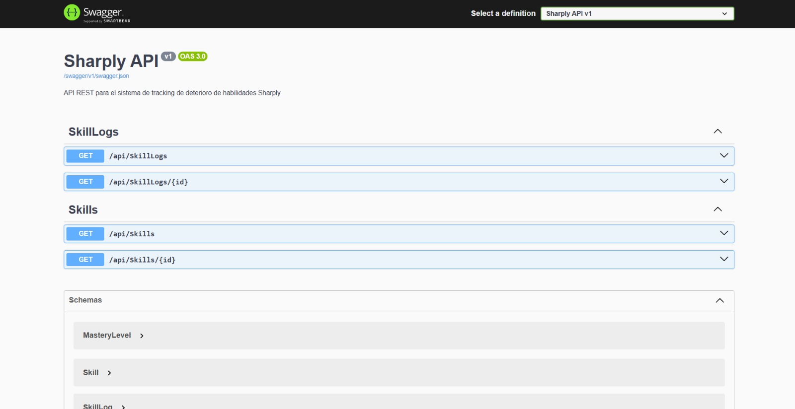

# ADR-04: Incorporación de una API REST con ASP.NET Core Web API

| Campo  | Valor        |
| ------ | ------------ |
| Autor  | Ariff Medina |
| Fecha  | 19/06/2026   |
| Estado | Aceptado     |

---

## Contexto

En el ADR-03 decidí utilizar la Arquitectura Hexagonal para organizar Sharply, separando el proyecto en las capas Domain, Application e Infrastructure. La idea principal era mantener la lógica de negocio independiente de cualquier tecnología o interfaz específica.

Hasta ese momento, el único punto de entrada contemplado era el proyecto MVC (`Sharply.Web`), pero todavía no contaba con vistas ni funcionalidades terminadas. Para esta entrega se solicitó implementar una API REST documentada con Swagger, por lo que fue necesario agregar un nuevo punto de entrada que permitiera acceder a la información del sistema mediante peticiones HTTP.

Además, debido al tiempo disponible y a que el proyecto MVC aún no aportaba funcionalidades evaluables, decidí enfocar los esfuerzos en desarrollar la API. Esto permite demostrar el funcionamiento de la arquitectura propuesta sin invertir tiempo en una interfaz que todavía no sería utilizada.

---

## Decisión

Se creó un nuevo proyecto llamado Sharply.Api utilizando ASP.NET Core Web API. Este proyecto funciona como un punto de entrada hacia la aplicación y se comunica con las capas Application e Infrastructure mediante las interfaces ya definidas.

También se configuró **Swagger** para generar automáticamente la documentación de los endpoints y se implementaron dos controladores iniciales:

| Controller | Responsabilidad |
|---|---|
| SkillsController | Exposición de habilidades del usuario |
| SkillLogsController | Exposición del historial de práctica |

---

### Justificación

**Compatibilidad con la Arquitectura Hexagonal**
La API actúa únicamente como intermediaria entre el cliente y la lógica de negocio. Los controladores reciben las solicitudes, llaman a los servicios correspondientes y devuelven los resultados. Toda la lógica relacionada con habilidades, misiones o cálculos permanece dentro de las capas del dominio y aplicación.

**Modelo sencillo de exponer mediante REST**
Las entidades principales del sistema (`Skill`, `SkillLog` y `User`) encajan de forma natural con el modelo REST. Operaciones como consultar una habilidad o listar registros pueden representarse fácilmente mediante endpoints HTTP estándar.

**Documentación automática con Swagger**
Swagger permite visualizar y probar los endpoints desde una interfaz web sin necesidad de herramientas externas. Además, la documentación se genera automáticamente a partir de los controladores y atributos definidos en el código.

**Preparación para futuros clientes**
Uno de los objetivos del proyecto es que en el futuro pueda existir una aplicación móvil desarrollada en MAUI. Al exponer los datos mediante una API REST, cualquier cliente compatible con HTTP podrá consumir la información sin modificar la lógica interna del sistema.

**Soporte para filtros**
Se añadieron filtros mediante query strings para realizar búsquedas más específicas:

```http
GET /api/skills?priority=Alta
GET /api/skilllogs?skillId={id}
```

Esto permite ofrecer funcionalidades adicionales sin realizar cambios en el núcleo de la aplicación.

---

## Alternativas consideradas

| Alternativa | Motivo de descarte |
| ----------- | ------------------- |
| **GraphQL** | Ofrece mayor flexibilidad en las consultas, pero para un proyecto pequeño como Sharply habría añadido complejidad innecesaria. Las entidades son simples y las operaciones requeridas pueden resolverse fácilmente mediante REST. Además, REST cuenta con mejor soporte dentro del contexto del curso y resulta más familiar para la mayoría de desarrolladores. |

---

## Consecuencias

### Beneficios

- La lógica de negocio permanece desacoplada de la tecnología utilizada para exponerla.
- Swagger proporciona documentación interactiva de forma automática.
- La API puede ser consumida posteriormente por una aplicación MAUI u otros clientes.
- Se valida en la práctica la estructura propuesta en la Arquitectura Hexagonal.

### Costos y limitaciones

- Por ahora solo se implementaron endpoints de consulta (`GET`).
- Fue necesario resolver conflictos de dependencias y versiones de paquetes entre los distintos proyectos de la solución.
- La configuración inicial resulta más compleja que en una aplicación monolítica, aunque aporta una mejor separación de responsabilidades.

---

## Capturas de Swagger



---

### 🤖 Declaración de uso de Inteligencia Artificial

Durante el desarrollo de esta actividad utilicé Claude como herramienta de apoyo para resolver dudas técnicas y ayudar en la corrección de errores relacionados con dependencias y configuración del proyecto.

Las decisiones de diseño, la selección de la arquitectura, la definición de las entidades y la justificación de las decisiones tomadas fueron realizadas por mí con base en los contenidos revisados en clase y en las diapositivas proporcionadas por el profesor Jorge Pedrozo.
