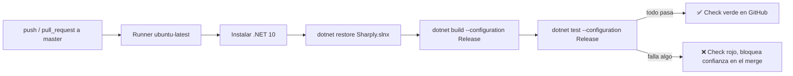

# ADR-07: Adopción de GitHub Actions como herramienta de Integración Continua

| Campo  | Valor |
|--------|-------|
| Autor  | Ariff Medina |
| Fecha  | 29/07/2026 |
| Estado | Aceptado |

---

## Contexto

Hasta ahora, la única verificación de que Sharply compila y se comporta como se espera era manual: yo corría `dotnet build` y probaba a mano antes de subir un cambio. Eso funcionó mientras el proyecto fue chico, pero dejó de ser suficiente después del saneamiento reciente: se activó un `BackgroundService` real (`DecayWorker`) que antes fallaba en el primer ciclo, se introdujo una capa de DTOs propia en la Api que cambió el contrato de las respuestas, y `AuthService` se desacopló de `AppDbContext` vía `IUserRepository`. Son exactamente el tipo de cambios donde una regresión no se nota compilando — se nota en tiempo de ejecución, si alguien se acuerda de probarlo.

Además, reciéntemente se creó `Sharply.Tests` con los primeros tests unitarios reales del proyecto (sobre `EbbinghausDecayStrategy`, el núcleo del algoritmo de decaimiento). Tener tests y no correrlos automáticamente en cada cambio deja la mayor parte de su valor sobre la mesa.

---

## Decisión

Adoptar **GitHub Actions** como herramienta de Integración Continua para Sharply, con un workflow (`.github/workflows/ci.yml`) que se dispara en `push` y `pull_request` hacia `master`, corre en un runner `ubuntu-latest`, instala .NET 10, y ejecuta `dotnet restore` → `dotnet build` → `dotnet test` sobre `Sharply.slnx`.

### ¿Por qué?

El código de Sharply ya vive en GitHub, así que Actions no agrega un proveedor nuevo que mantener ni una cuenta más que gestionar — es la misma plataforma, sin costo adicional para un repositorio de este tamaño. Es coherente con la filosofía de simplicidad operativa que ya guio la decisión de ADR-03 (evitar infraestructura que un proyecto individual con entregas semanales no puede permitirse mantener).

### Qué se prueba y por qué se eligió esa clase

`ubuntu-latest` no tiene LocalDB disponible, así que cualquier test que dependa de `AppDbContext` o de una base real queda automáticamente descartado para este pipeline. Eso restringe la elección a lógica que no dependa de infraestructura — y `EbbinghausDecayStrategy.Calculate` (`Sharply.Application/Services/EbbinghausDecayStrategy.cs`) es la candidata natural: recibe `double`/`enum`, devuelve `double`, sin `ISkillRepository`, sin `DbContext`, sin nada async. Es matemática pura, así que corre igual en Windows que en el runner Linux.

`Sharply.Tests/EbbinghausDecayStrategyTests.cs` cubre 3 casos:

| Test | Qué verifica |
|------|--------------|
| `Calculate_WithZeroDaysInactive_ReturnsInitialRetention` | Caso límite: con 0 días inactivo, la retención debe ser exactamente la inicial (`e^0 = 1`). Protege la invariante de negocio "recién practicado = sin decaimiento todavía". |
| `Calculate_WithIntermediateMediumAtStabilityBoundary_ReturnsExponentialDecayConstant` | Caso de valor exacto: con `daysInactive/stability = 1`, el resultado tiene que coincidir con la constante matemática `e⁻¹ ≈ 0.3679`. Verifica que la curva exponencial y el redondeo a 4 decimales funcionan como espera la fórmula, no solo el caso trivial de 0 días. |
| `Calculate_ComparesSharpHighVsRustyLow_HigherMasteryAndPriorityDecaySlower` | Test comparativo: para los mismos días inactivos, `Sharp`+`High` tiene que retener más que `Rusty`+`Low`. Verifica la regla de negocio real del algoritmo — mayor dominio y prioridad decaen más lento — sin depender de un valor exacto calculado a mano. |

No se testean `MissionService`, los controladores de la Api ni el flujo completo del `DecayWorker` en esta primera pasada: todos dependen de `DbContext` o de servicios externos (SMTP), y probarlos en CI sin LocalDB hubiera significado mockear tanto que el test dejaría de validar el comportamiento real — mejor dejarlos fuera de forma explícita que fingir cobertura que no existe.

### Alternativas consideradas

| Alternativa | Por qué la descarté |
|-------------|---------------------|
| Jenkins | Requiere levantar y mantener un servidor propio (actualizaciones, plugins, seguridad). Para un proyecto individual, esa carga operativa no tiene contrapartida — es la misma razón por la que ADR-03 descartó microservicios. |
| Azure DevOps Pipelines | El código no vive ahí — usarlo significaría espejar el repositorio o mantener una integración cruzada solo para el CI, duplicando el lugar de verdad del proyecto sin necesidad. |
| GitLab CI | Mismo problema que Azure DevOps: el repositorio está en GitHub, no en GitLab. Adoptarlo exigiría infraestructura de sincronización que no aporta nada frente a la opción nativa. |
| CircleCI / otro SaaS externo | Agrega una cuenta y un proveedor externo más para administrar, sin ninguna ventaja sobre lo que GitHub ya ofrece de forma integrada y gratuita para este volumen de uso. |

---

## Consecuencias

**✅ Lo que gano:**

*Detección temprana de regresiones:* justo después de activar `DecayWorker` y cambiar el contrato de la Api, el pipeline corre los tests en cada cambio sin que dependa de que yo me acuerde de hacerlo a mano.

*Primera red de seguridad real:* `Sharply.Tests` deja de ser solo un proyecto local — sus 3 tests sobre `EbbinghausDecayStrategy` corren automáticamente y protegen el algoritmo de Ebbinghaus contra cambios accidentales, que es justo el guardrail que me propuse no romper.

*Feedback rápido y visible:* un ✅ o ❌ en la pestaña Actions de GitHub, sin instalar nada adicional ni depender de mi propia máquina.

**⚠️ Lo que sacrifico o asumo:**

*Sin cobertura de integración contra base real en CI:* `ubuntu-latest` no tiene LocalDB, así que cualquier test que dependa de SQL Server real queda fuera de este pipeline. Por eso los tests iniciales son unitarios puros sobre el algoritmo de decaimiento, sin tocar `ISkillRepository` ni el `DbContext` — es una limitación real, no una elección de cobertura.

*Cobertura todavía chica:* el pipeline valida lo que hoy existe (3 tests), no todo el sistema. `MissionService`, los controladores de la Api y el flujo completo del `DecayWorker` siguen sin tests automatizados — queda como trabajo futuro, no como parte de esta decisión.

---

## Diagrama

---

## Cláusula de uso de IA

Este ADR se elaboró con apoyo de un asistente de IA (Claude), usado para redactar el documento y verificar los hallazgos (proyectos existentes, tests creados, decisiones previas) contra el estado real del repositorio. El pipeline de CI y los tests de `Sharply.Tests` que este ADR documenta fueron diseñados junto con el asistente, pero cada decisión de alcance y cada test fue revisado y aprobado por el autor antes de aplicarse.
