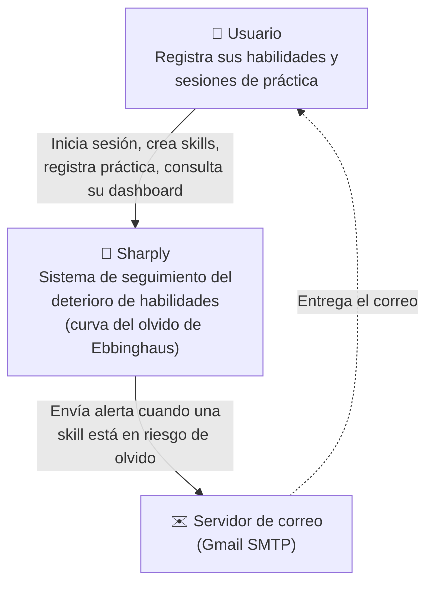
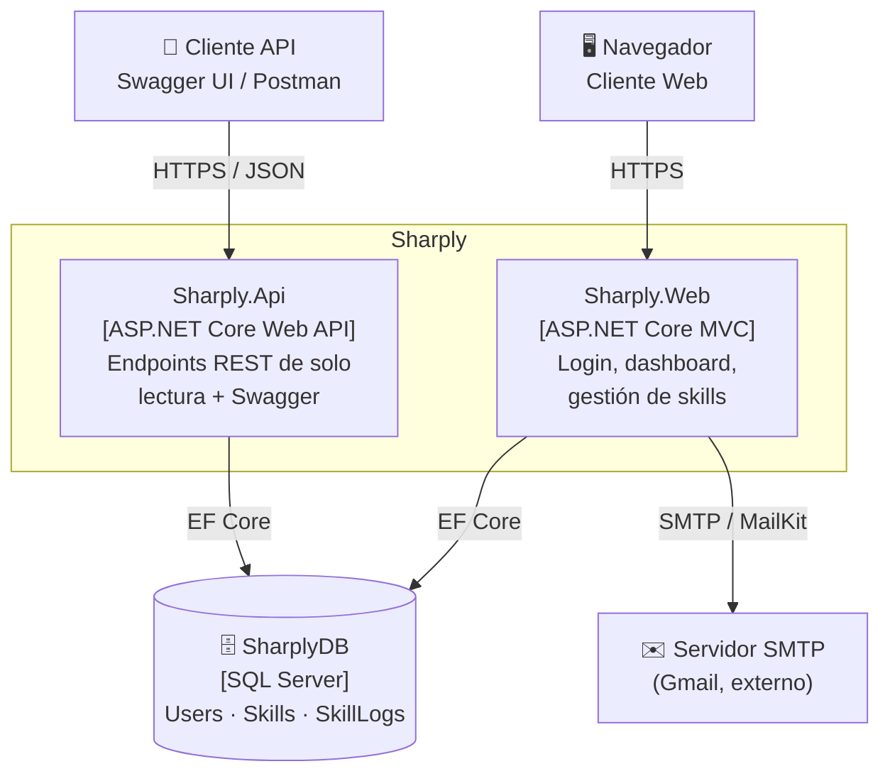
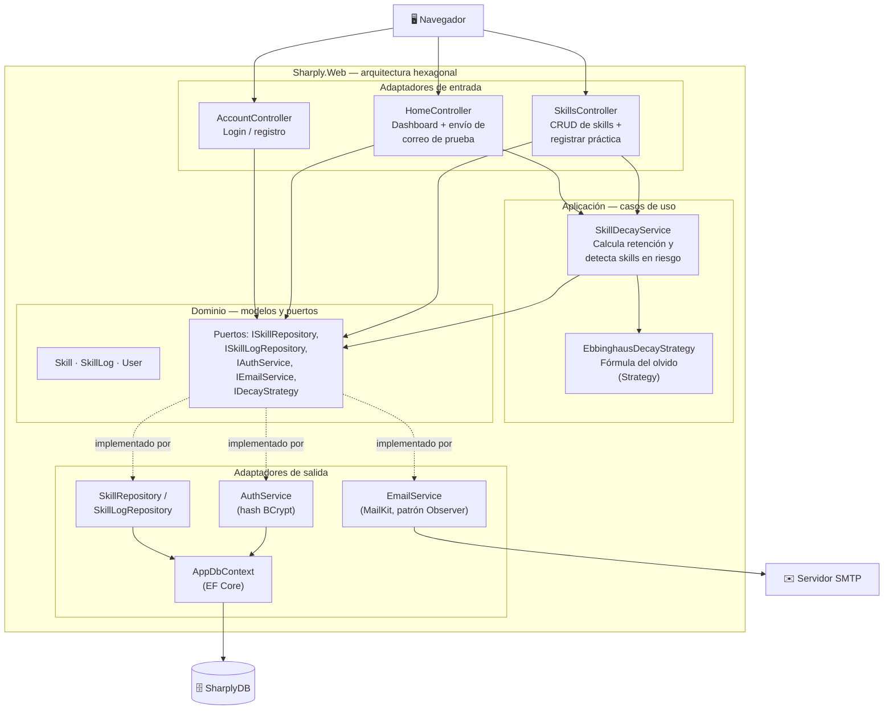

# Diagramas de Arquitectura — Sharply (Modelo C4)

## Nivel 1 — Contexto

*Para: Cualquier persona interesada en mi plataforma y que quiera tener una noción primaria del funcionamiento de esta. Responde: ¿Qué es el sistema y quién lo usa?*

## Nivel 2 — Contenedores

*Para: El equipo técnico que necesita entender la estructura general del sistema. Responde: ¿De qué piezas grandes se compone?*

## Nivel 3 — Componentes dentro de Sharply.Web

*Para: Aquellos que van a modificar el código de la plataforma y que necesitan entender la estructura interna de cada componente. Responde: "¿Qué hay dentro de cada pieza?*

